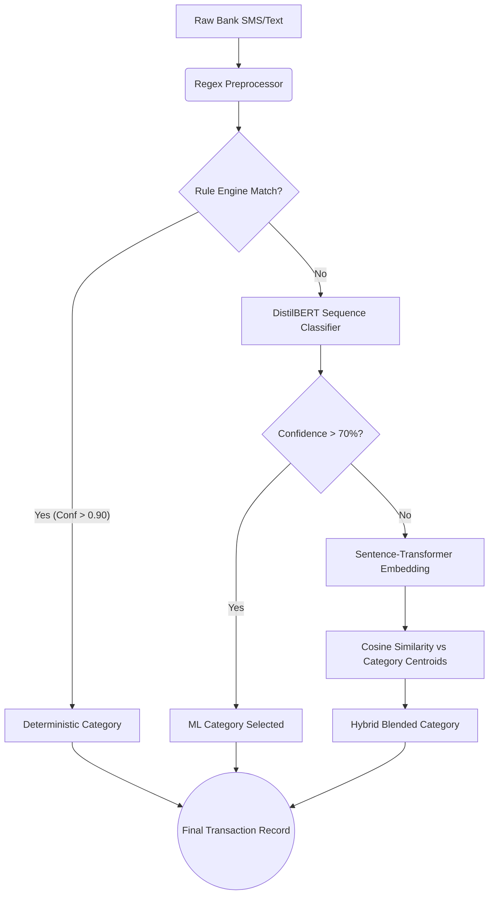
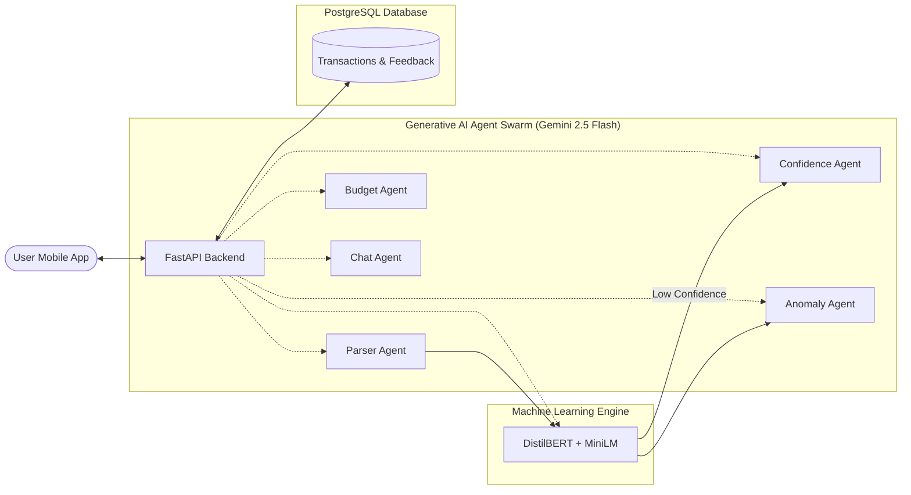

# AI in Finance & Banking: TransactAI Architecture

TransactAI leverages a hybrid Artificial Intelligence architecture designed specifically for personal finance and banking. The system utilizes a combination of **Classical NLP (Natural Language Processing)**, **Deep Learning**, and **Generative AI (Large Language Models)** to process, categorize, and analyze raw financial data (e.g., bank SMS messages or user input).

This document outlines the models used, their roles, and the overall AI architecture of the project.

---

## 1. Machine Learning: Transaction Categorization Engine
The core of the transaction processing pipeline is the `TransactionClassifier` (located in `core/model.py`). This engine is responsible for accurately placing a transaction into a category (e.g., *Food, Fuel, Medical, Subscription*) based on raw text. 

It uses a **Hybrid Fallback Architecture** to maximize accuracy and minimize latency.

### Models Used
*   **Primary Deep Learning Model**: `distilbert-base-uncased` (Hugging Face). A fine-tuned sequence classifier that predicts the probability of a transaction belonging to a specific category.
*   **Embedding/Vector Fallback Model**: `sentence-transformers/all-MiniLM-L6-v2`. Creates high-dimensional vector embeddings of transaction text. It uses Cosine Similarity against known "Category Centroids" if the primary model is unsure.

### Categorization Flow Diagram

---

## 2. Generative AI (LLMs): Financial Agent System
To move beyond simple categorization, TransactAI utilizes **Generative AI Agents** (located in `api/core/agents/`). These agents act as automated financial advisors and data extractors.

### Model Used
*   **Primary Generative Model**: Google's `gemini-2.5-flash` via the `google-genai` SDK using strict Structured JSON outputs.
*   **Local Strategy**: A local fallback model (`local_brain.py`) capable of running ONNX quantized models offline if the cloud API is inaccessible.

### The 5 AI Agent Roles
1.  **Parser Agent** 🕵️: Reads unstructured bank SMS messages and extracts key-value pairs (Amount, Merchant, Date, Transfer Type).
2.  **Anomaly Agent** 🚨: Analyzes the transaction amount and merchant against the user's historical baseline to flag fraudulent or unusual spending.
3.  **Confidence Agent** 🧠: Triggered when the ML Categorization Engine fails (Confidence < 70%). It provides the user with an AI-generated explanation of why the text is confusing and suggests the top 3 most likely categories.
4.  **Budget Agent** 📉: Ingests the user's monthly spending summary and outputs personalized, actionable financial advice (e.g., *"You've spent 40% of your budget on food, consider cooking at home next week."*)
5.  **Chat Agent** 💬: A conversational interface that allows the user to ask plain-English questions about their finances.

### System Architecture Diagram

## 3. Continuous Learning (Human-in-the-loop)
TransactAI does not remain static. It features an automated retraining loop.
When the `ConfidenceAgent` asks a user to manually correct a miscategorized transaction, that correction is saved to a `Feedback` table. A nightly background task (using `pandas` and `scikit-learn` utilities) compiles this feedback and locally fine-tunes the `DistilBERT` model, updating the weights dynamically so the system learns the user's specific spending habits over time.
